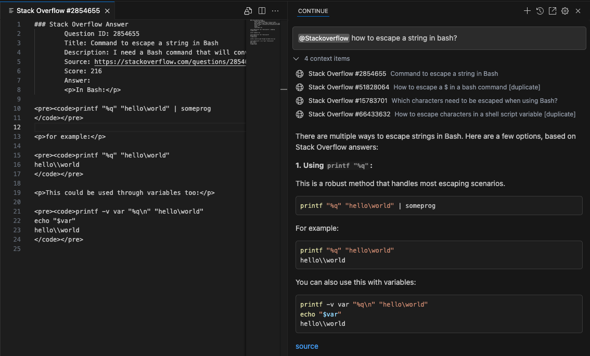

# Electron Search

Simple Electron app for interacting with websites to populate the context to use with [continue.dev](https://github.com/continuedev/continue/) in [VSCode](https://code.visualstudio.com/).

The app provides a simple api for searching on google and parsing the results. Returning a format compatible with continue.dev.

It allows to add a context, for example `@stackoverflow` in a search and then the context is populated with the accepted answers from stack overflow.


The screenshot showing a search with the stack overflow context, the sources can be seen in the top, clicking them shows the actual answer.
The LLM answer will contain a `source` link to the question on Stack Overflow.

# Running

The app is just a browser window, first install the dependencies and the run. [NodeJs](https://nodejs.org) is required to run the app.

Install dependencies
```
    npm install
```

Start the App
```
    npm start
```

# Stack Overflow in Continue.dev

## Overview

The Stack Overflow context fetcher is doing the following:
- Searching on Google with `site: site:stackoverflow.com`. Then parses the results to JSON.
- For each result, queries the Stack Exchange API for the answers and filters on accepted answers.
- Returns the answers in a format compatible with continue.dev context

## Using

To use it, the config for continue.dev needs to be updated, then the app should be started.

The app the google results that are loaded, so you can handle any potential captchas.

Note: Stack Exchange have a limit of 300 request per day.

## Continue.dev Config

Edit your `~/.continue/config.yaml` to

- Add a http provider
- Add a rule

The http provider should point to the local server, port can be changed.
```
context:
  - provider: code
  ...
  - provider: http
    params:
      url: http://localhost:3300/stack-overflow
      title: http
      displayTitle: Stackoverflow
      description: Get accepted answers from stack overflow on the topic
      options:
        maxItems: 3
```

The rule to make sure answers are formatted nicely and that the LLM notifies if there are no answers.
```
rules:
  - |
    
        You are a helpful assistant that answers questions using accepted answers from Stack Overflow when available.
        <important_rules>If no answer is available, just answer with `No answer found on Stack Overflow`.</important_rules>

        You will receive none or multiple Stack Overflow answers in the following format:
        <example>
            ### Stack Overflow Answer
            Title: <title of the related Stack Overflow question>
            Description: <brief description or excerpt from the question>
            Source: <URL to the Stack Overflow answer>
            Answer number: <ordinal position of the answer>. Score: <numeric score>
            Answer:
            <content of the accepted answer>
        </example>

        Instructions:
        - If one or more accepted answers are provided:
            - Choose the answer that best matches the user's question in terms of relevance and score.
            - Use the selected answer to craft a helpful and concise response.
            - You may paraphrase or simplify the accepted answer, but the core content must remain accurate.
            - Always cite the source with a clickable Markdown link: `[source](<url>)`.
            - If multiple answers are relevant, you may combine their content.
            - If there are **contradicting answers**, present each one clearly with its source, summarize their differences, and offer your informed opinion or recommendation based on:
                - Score (higher is generally more trusted)
                - Recency (if available)
                - Broad applicability and correctness
                - Known best practices
        - If **no accepted answers are provided**, you may answer using your own knowledge, but:
            - Clearly state that no Stack Overflow answers were provided.

        - Format your response in **Markdown**.
        - Wrap all code blocks in triple backticks and include the programming language if known or inferred.
        
        <example>
        ```<language>
        <code>
        ```
        </example>
    
```

## Stack Over Endpoint Specification

If you use the app separately, this is how the endpoint acts:

Request:
```
POST /stack-overflow
{
    fullInput: "<search query>"
}
```

Response with Results:
```
[
  {
    "name": "Stack Overflow #2854655",
    "description": "Command to escape a string in Bash",
    "content": "### Stack Overflow Answer
        Question ID: 2854655
        Title: Command to escape a string in Bash
        Description: I need a Bash command that will convert ...
        Source: https://stackoverflow.com/questions/2854655/c...
        Score: 216
        Answer:
        <p>In Bash:</p>
        ...
        "
  },
  ...
]
```

Response with No Results:
```
{
    name: `Stack Overflow`,
    description: `No answers available`,
    content: `No Stack Overflow answers available.`,
}
```

Test the api with curl
```
curl -X POST -H "Content-Type: application/json" -d '{"query": "", "fullInput": "how to escape a string in bash?"}' http://localhost:3300/stack-overflow
```